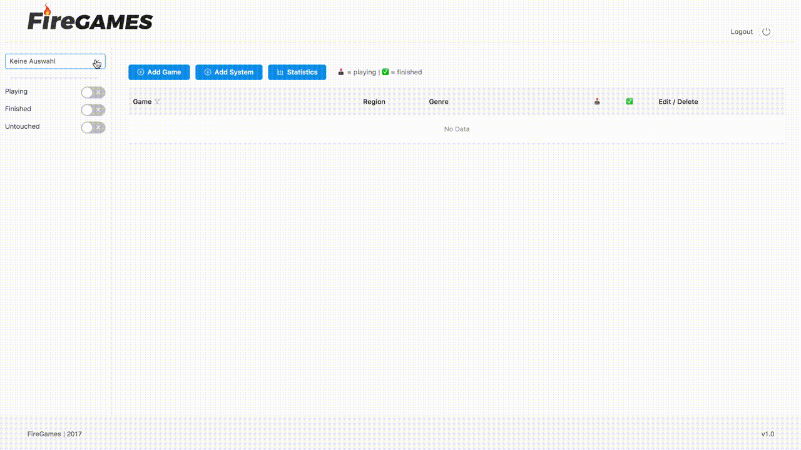
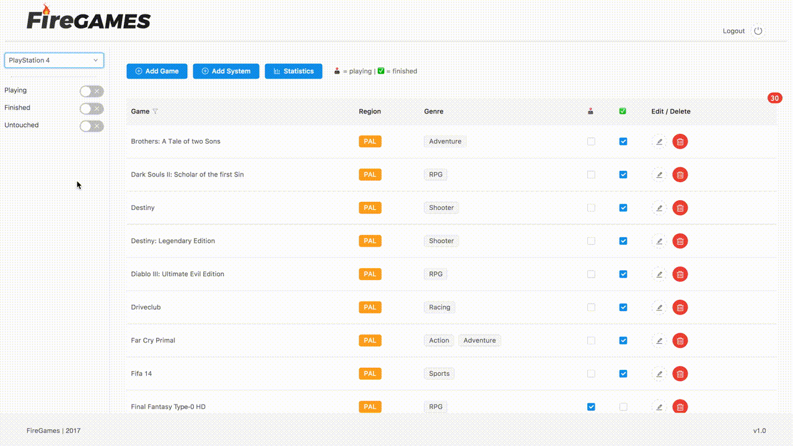

# HOW TO USE

Before using your self hosted FireGames App, you have to do a approximately 10 min setup.

## Create a Firebase account
Here you go: https://firebase.google.com/
## Create your Firebase API Key

Copy & paste it to`src/app/config/config.js`

```javascript
const config = {
	/* Initialize Firebase
	 * PASTE YOUR FIREBASE API KEY HERE
	*/
};

export default config;
```

## Create a Login Profile in your Firebase

Under `Authentication`, enable `Email/Password` Authentication and create a User with Email and Password. You will get some User ID which you need in the next step.

## Set your read- and write rules in Firebase

In Firebase Database, head to `Rules` and edit your read- and write rules (usually you don't want others to add data to your Firebase)

Example:

```javascript
{
  "rules": {
    ".read": true,
    ".write": "auth != null && auth.uid == 'YOUR UID FROM YOUR LOGIN GOES HERE'"
  }
}
```

## You are almost there
Hit `yarn run dev` for development and `yarn run build-app` for production




