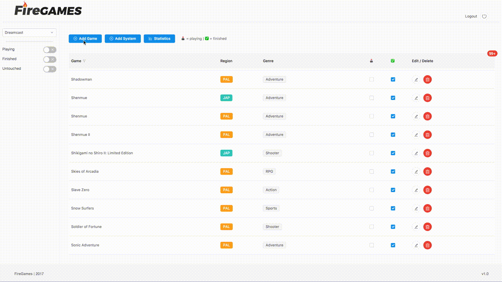
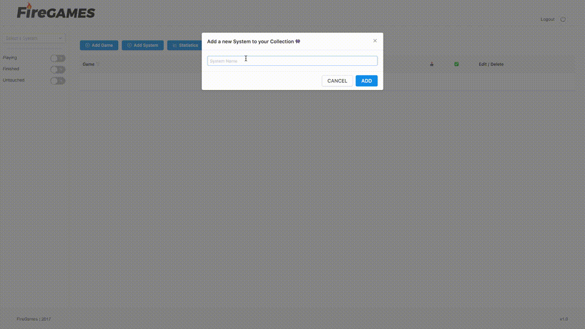
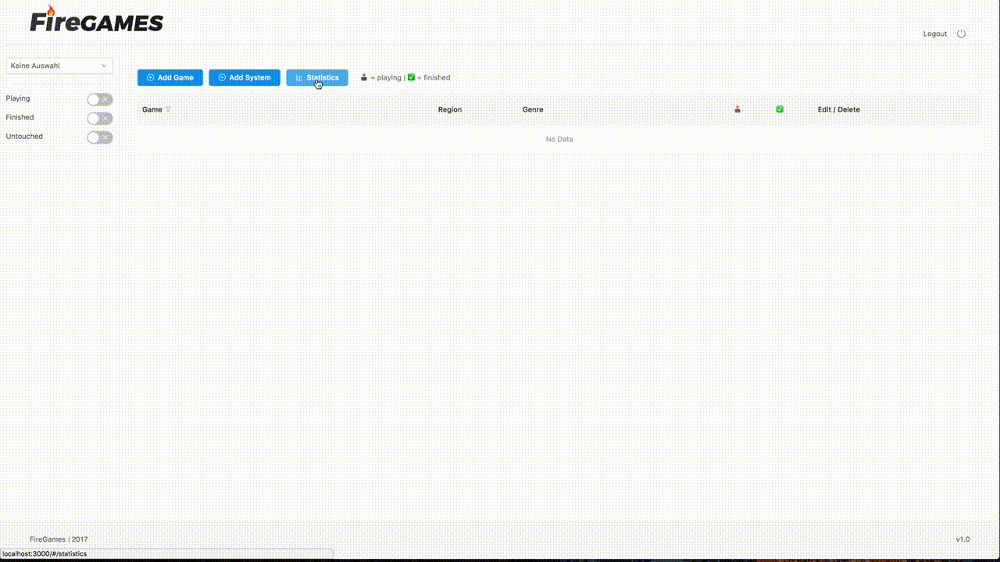
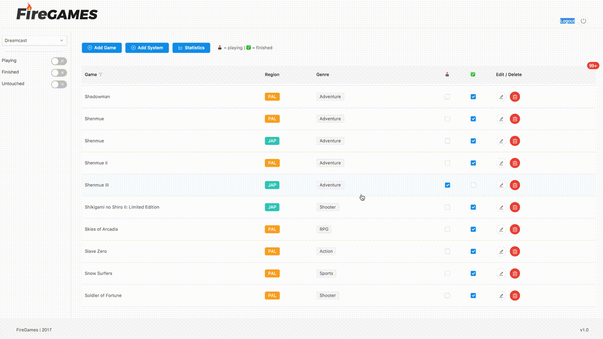

# HOW TO USE

Before using your self hosted FireGames App, you have to do a approximately 10 min setup.

## Create a Firebase account
Here you go: https://firebase.google.com/

## Create your Firebase API Key

Create a new directory, called `config` under `src/app/`.

Then, create a `config.js` file in `src/app/config/` with the following contents:

```javascript
const config = {
	/* Initialize Firebase
	 * PASTE YOUR FIREBASE API KEY HERE
	*/

	// example API Key
	apiKey: 'CDe##################################',
	authDomain: 'my-game-data.firebaseapp.com',
	databaseURL: 'https://my-game-data.firebaseio.com',
	projectId: 'my-game-data-c12345',
	storageBucket: 'my-game-data-c12345.appspot.com',
	messagingSenderId: '1##########2',
};

export default config;
```

## Create a Login Profile in your Firebase

Under `Authentication`, enable `Email/Password` Authentication and create a User with Email and Password. You will get some User ID which you need in the next step.

## Set your read- and write rules in Firebase

In Firebase Database, head to `Rules` and edit your read- and write rules (usually you don't want others to add data to your Firebase)

Example:

```javascript
{
	"rules": {
		".read": true,
		".write": "auth != null && auth.uid == 'YOUR UID FROM YOUR LOGIN GOES HERE'"
	}
}
```

## You are almost there
Hit `yarn run dev` for development and `yarn run build-app` for production

# FEATURES

[comment]: <> (used gif converter urlhttps://cloudconvert.com/mov-to-gif)

## Select system & fetch data


## Filtering

There are 3 Filters available: `playing`, `finished` and `untouched`
The states `playing` and `finished` are self explaining. If a game is `untouched`, you've never played it and never finished it as well (obviously 😃).


## Add game


## Add system / console


## Statistics


## Editing


## Delete game

